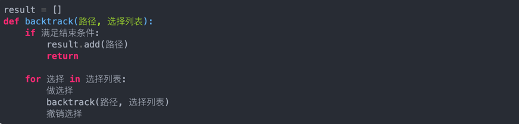

### 回溯算法 O(n!)
- 求所有的可行解, 不会求最值!! 实际就是遍历多叉树的结构
- 区别于动态规划:
  - 动态规划只需要求我们评估最优解是多少，最优解对应的具体解是什么并不要求
  - 回溯算法可以搜索得到所有的方案（当然包括最优解），但是本质上它是一种遍历算法，时间复杂度很高
  - 不像动态规划存在重叠子问题可以优化，回溯算法就是纯暴力穷举，复杂度一般都很高
- 套路解:
  - 路径：也就是已经做出的选择。
  - 选择列表：也就是你当前可以做的选择。
  - 结束条件：也就是到达决策树底层，无法再做选择的条件。
  - 
- 参考：
  - https://labuladong.github.io/algo/di-ling-zh-bfe1b/hui-su-sua-c26da/
  - https://www.bilibili.com/video/BV1P5411N7Xc/?spm_id_from=333.337.search-card.all.click&vd_source=c0808a52efcf11b005f1df5936845dd2